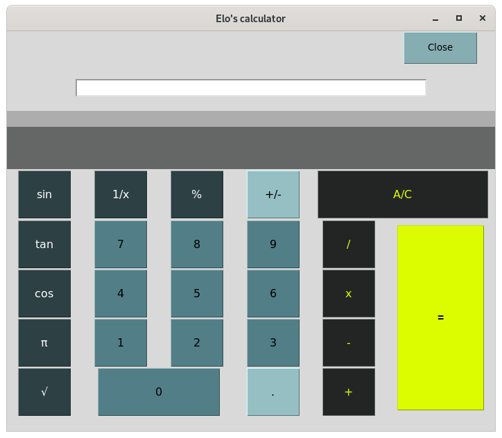

# python_d03

calculator with python3 / tkinter

**Hi user!**

This project is a basic calculator wich manage basic operations and some scientific functions.
It was developped during my training "coding academy" by Epitech, in april 2020. 
This project was developped with python3 langage and Tkinter.
It use the module math

**WHAT THIS APP DO**

Use it to make all operations you need, according to the operator represented.
"+" to make additions
"-"to make substractions
etc...

you can also launch some usual scientific functions (tan, sin, cos, . . . ) with bases 10 only here

 


**HOW TO USE IT**
Into the terminal:
from the repo:

```
./main
```

execute the programme

**LIST OF FILES/DIRECTORIES**

- calculatrice.py : This file manage the view, and display user's "click"
- basic_op.py : basic functions, listen input returned by calculatrice.py and make basics operations, to, finally return the results. 
- scientific.py : manage scientific operations requested and return results to calculatrice.py

*Thanks to read me have a nice day !*

